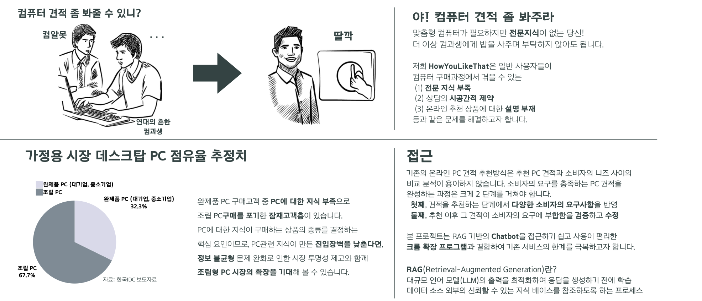
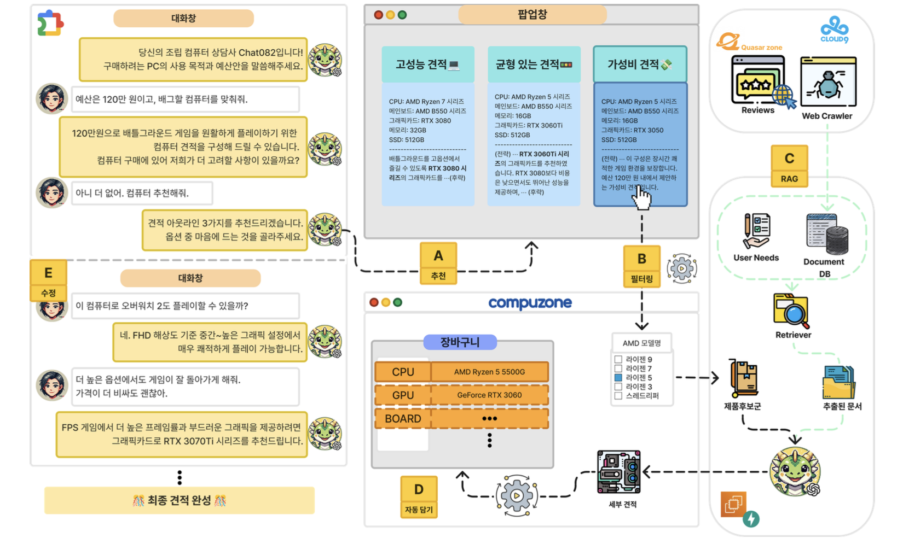

# CHAT-082: 당신의 컴퓨터 구매 가이드

## 개요
**CHAT-082**는 사용자가 요구하는 컴퓨터 사양에 맞는 맞춤형 견적을 제공하는 챗봇입니다.

소비자가 조립형 PC를 구매할 때, 높은 진입장벽(부품에 대한 지식 부족)과 정보 불균형, 오프라인 상담의 시공간적 제약 등 여러 어려움이 있습니다. Chat-082는 RAG를 활용하여 사용자 맞춤형 컴퓨터 견적을 제공하는 챗봇으로, 사실 기반의 견적 구성과 채팅 기능을 통해 최적의 견적을 검증 및 수정하는 과정을 제공합니다. 

---

## 파이프라인

### A. 사용자 요구사항 구체화 및 후보 견적 제안
- OpenAI API를 호출하는 챗봇 대화를 통해 사용자 예산 및 구매 목적을 구체화.
- 이를 바탕으로 팝업창에 GPT가 생성한 시리즈 단위(ex. RTX 4060)로 구성된 3가지 후보 견적을 제안.

### B. 필터링 및 제품 정보 전달
- 컴퓨존 웹사이트의 견적 창에서 사용자가 선택한 부품 시리즈로 필터를 적용.
- 실제 제품 후보들(ex. [MSI] GeForce RTX 4060 벤투스 2X 8GB)의 정보를 백엔드 서버에 전달.

### C. RAG 기반 최적의 제품 선택
- 예산, 사용 목적, 시리즈 정보와의 유사도를 기반으로 견적 상담 내역이 담긴 DB에서 context를 retrieve.
- 이 context와 제품 후보 정보를 GPT에 제공하여 RAG를 통해 최적의 제품을 선정.

### D. 자동 장바구니 담기
- GPT가 선정한 실제 제품을 컴퓨존 웹사이트 장바구니에 자동으로 담기.

### E. 최종 견적 완성
- 사용자가 추가 대화를 통해 제품에 대해 질문하거나 세부 부품을 교정.
- 이를 통해 최종 견적을 완성.